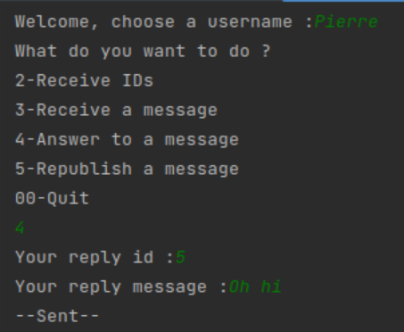

<h1 align="center" > MicroBlogging </h1>
<h3 align = "center" >College networking Projet</h3> 

  <h4>Part 1: Requests/Responses</h4>

 To run the Requests/Responses section, Simply run the Server.java class and one of the following clients:

Follower.java: It allows us to choose between: Receiving message IDs sent by one or more users or messages containing specific tags,
receiving a message by providing an ID, reposting a message by providing an ID and finally, responding to a message by providing an ID.

Reposter.java: To repost all messages sent by one or more users

Publisher.java: To publish messages to the server

  <h4>Publisher</h4>

  

  <h4>Follower</h4>
  

  <h4>Server</h4>
  </img>

  <h4>Part 2: Stream management</h4>
  
  
  As for the Stream Management section, You need to run the MicroblogCentralServer.java class and one of the following clients:

 MicroblogCentralClient2.java and MicroblogCentralClient.java (they are identical) which allow you to:
Send messages to the server and to clients that have subscribed to the user or specific tags,
repost messages, reply to messages, subscribe to users and/or tags, unsubscribe from users and/or tags. 

  <h4>Client 1</h4>
  

  <h4>Client 2</h4>
  

  <h4>Server</h4>
  </img>

  <h2 align="center">Programming language :</h2>
  

  <h2 align="center">Operating systems :</h2>
  
  

  <h2 align="center">Tool :</h2>
  

